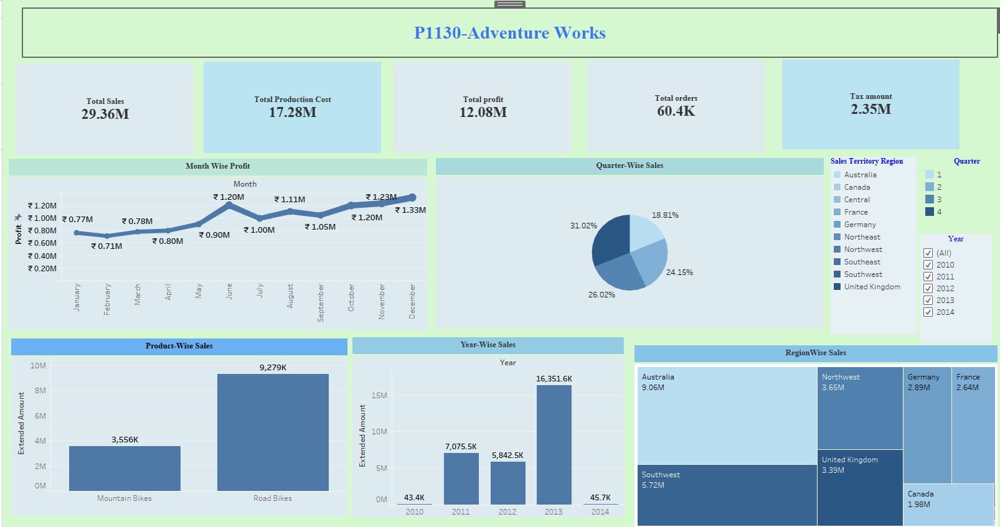

# 📊 Adventure Works Tableau Dashboard

## 🚀 Project Overview
This project presents an interactive Tableau dashboard built using the Adventure Works dataset. It focuses on analyzing sales performance, profitability, and business trends using visually rich and dynamic dashboards.

The dashboard enables users to explore key metrics and gain insights into sales, production cost, profit, and regional performance.

---

## 🎯 Business Objective
The goal of this project is to transform raw sales data into meaningful insights that support business decision-making by:

- Tracking sales and profit performance  
- Identifying top-performing products and regions  
- Analyzing trends over time  
- Enabling interactive exploration of data  

---
## 📸 Tableau Dashboard Preview

## 🛠️ Tools Used
- Tableau Desktop  
- Data Visualization  
- Dashboard Design  

---

## 📊 Key KPIs
- Total Sales: 29.36M  
- Total Production Cost: 17.28M  
- Total Profit: 12.08M  
- Total Orders: 60.4K  
- Tax Amount: 2.35M  

---

## 📈 Dashboard Insights

### 📅 Month-wise Profit
- Displays monthly profit trends  
- Highlights peak months (Nov–Dec)  
- Helps identify seasonal patterns  

---

### 🥧 Quarter-wise Sales
- Q4 contributes the highest share (~31%)  
- Balanced performance across other quarters  
- Useful for quarterly planning  

---

### 📦 Product-wise Sales
- Road Bikes generate the highest revenue  
- Mountain Bikes contribute moderate sales  

---

### 📊 Year-wise Sales
- Significant growth observed in 2013  
- Lower sales in 2014 may indicate incomplete data or decline  

---

### 🌍 Region-wise Sales
- Australia and Southwest are top-performing regions  
- Canada has the lowest contribution  
- Helps identify target markets  

---

## 🎛️ Dashboard Features
- Interactive Filters:
  - Year  
  - Region  
  - Quarter  

- Dynamic visual updates  
- Clean and structured layout  
- Easy-to-understand insights  

---

## 💼 Business Value
This dashboard helps:
- Monitor business performance  
- Identify growth opportunities  
- Improve strategic decision-making  
- Analyze trends efficiently  

---

## 🔮 Future Improvements
- Add more advanced calculated fields  
- Improve design consistency and UI  
- Integrate with real-time data sources  

---

## 🙌 Connect With Me
- LinkedIn: https://www.linkedin.com/in/yash-jambhulkar-574b40242/  
- GitHub: https://github.com/yash36ai 

---

⭐ If you like this project, consider giving it a star!
